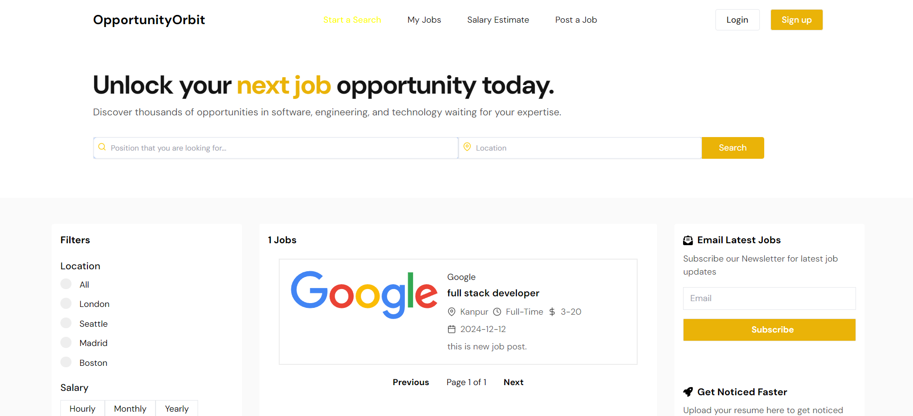
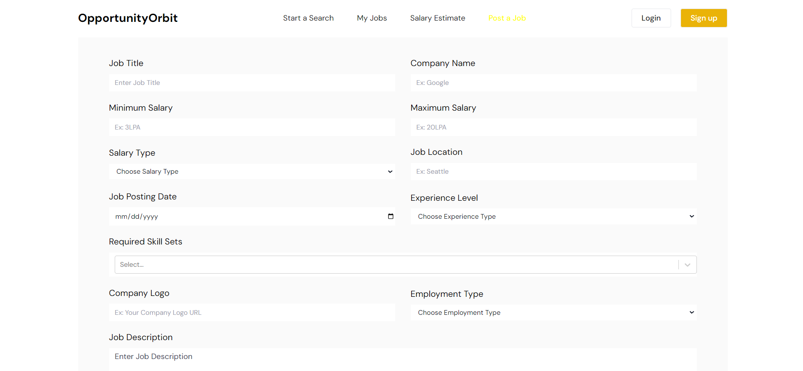
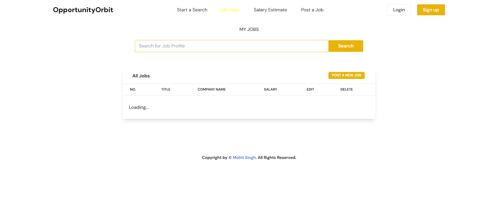

# 🌟 Opportunity Orbit Job Portal 🌟  

  

Welcome to **Opportunity Orbit**, the ultimate job portal connecting job seekers with employers seamlessly.  

---

## 🚀 Features  

- 🔒 **User Authentication**: Secure login and registration for candidates and employers.  
- 📃 **Job Listings**: Search and filter jobs across diverse industries.  
- 📊 **Application Tracking**: Stay updated on your job applications in real-time.  
- 🛠️ **Employer Dashboard**: Manage job postings, view, and shortlist applicants.  

---

## 🛠️ Technologies Used  

  
  
  
  

---

## 📸 Screenshots  

### 🏠 Home Page  
  

### 📃 Job Post Preview  
  

### 📊 My Jobs   
  

---

## 📚 Getting Started  

Follow these steps to set up the project locally:  

1. **Clone the repository**:  
   ```bash  
   git clone https://github.com/mohitsinghgarry/Opportunity-Orbit-job-Portal.git   

2. **Navigate to the project directory**:  
   ```bash  
   cd Opportunity-Orbit-job-Portal  
   ```  

3. **Install dependencies**:  
   ```bash  
   npm install  
   ```  

4. **Start the development server**:  
   ```bash  
   npm start  
   ```  

5. **Environment Variables**:  
   Configure the `.env` file with the following:  
   ```plaintext  
   DB_USER=<your-mongodb-username-string>  
   DB_PASSWORD=<your-db-password>  
   ```  

---

## 🤝 Contributing  

Contributions are always welcome!  

1. Fork the repository.  
2. Create a new branch for your feature: `git checkout -b feature-name`.  
3. Commit your changes: `git commit -m "Add some feature"`.  
4. Push to the branch: `git push origin feature-name`.  
5. Open a Pull Request.  

---

## 📄 License  

This project is licensed under the MIT License. See the [LICENSE](LICENSE) file for details.  

---

## 📬 Contact  

For inquiries, reach out to:  
📧 **Email**: [mohitsinghx4@gmail.com](mailto:mohitsinghx4@gmail.com)  
🔗 **GitHub**: [@mohitsinghgarry](https://github.com/mohitsinghgarry)  

---

🚀 **Let’s build the future of hiring with Opportunity Orbit!**  
```

Save this content as `README.md` in your repository root. Ensure the images in the `Frontend_codebase/public` directory are named correctly and properly accessible.
